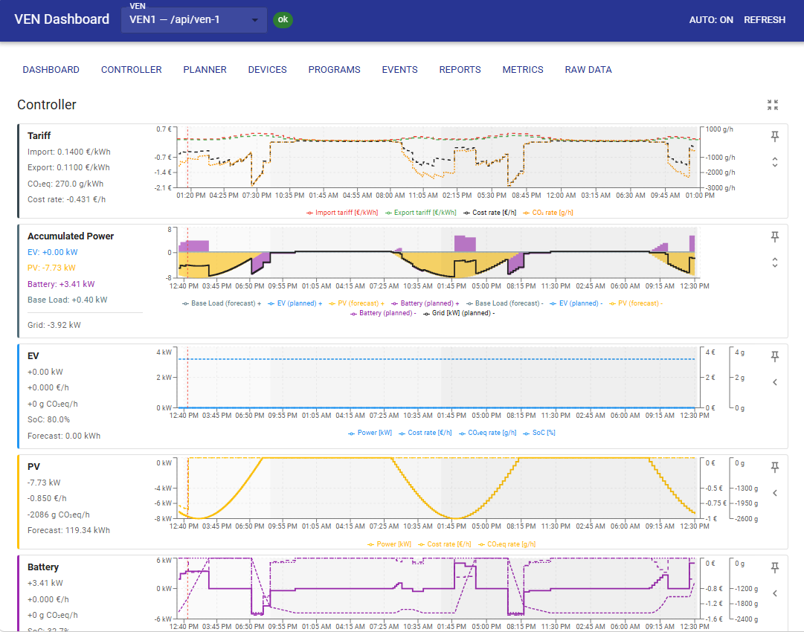
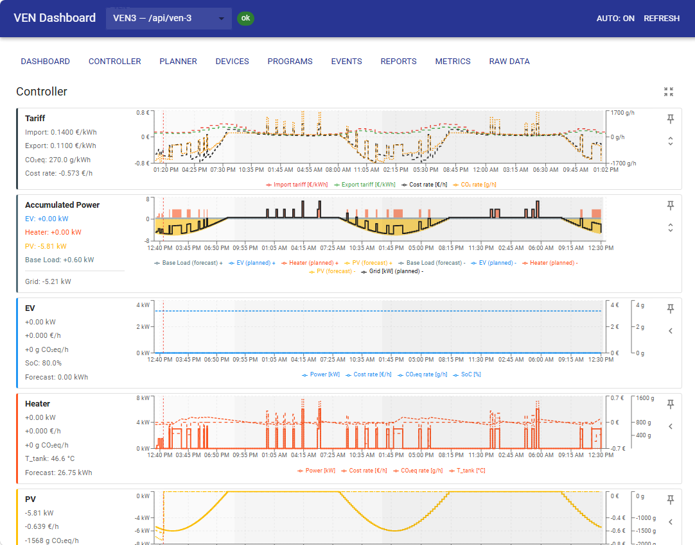

# OpenADR 3 Raspberry Pi Lab

A Raspberry Pi4-hosted **OpenADR 3.0 laboratory environment** for demand response experimentation, multi-VEN simulation, and edge computing research.

## The context

This project is built around the https://github.com/OpenLEADR/openleadr-rs project, and adds infrastructure to experiment and demonstrate. It is close to 100% written by AI which allowed me to get fast progress in short time. 
Tests guarantee the expected behaviour, side effects have not been checked, so no warranties for that!

## Architecture

```
Raspberry Pi 4 (Docker)
+------------------------------------------------+
|  VTN Stack                                     |
|  +--------+  +--------+  +---------+           |
|  | VTN    |  | BFF    |  | VTN UI  |           |
|  | :8200  |  | :8220  |  | :8221   |           |
|  +--------+  +--------+  +---------+           |
|  | DB     |                                    |
|  | :8201  |      openadr-net                   |
|  +--------+                                    |
|                                                |
|  VEN Stack                                     |
|  +---------+  +---------+  +---------+         |
|  | VEN-1   |  | VEN-2   |  | VEN-3   |         |
|  | :8211   |  | :8212   |  | :8213   |         |
|  +---------+  +---------+  +---------+         |
|  | VEN UI  |                                   |
|  | :8214   |                                   |
|  +---------+                                   |
+-----------------------------------------------+
```

| Component | Technology | Description |
|---|---|---|
| VTN | [openleadr-rs](https://github.com/OpenLEADR/openleadr-rs) (Rust) | OpenADR 3.0 Virtual Top Node |
| DB | PostgreSQL 16 | VTN persistence (auto-migrated) |
| BFF | Rust (axum) | Backend-for-frontend with dual OAuth credentials |
| VTN UI | React + MUI + nginx | Operator dashboard (programs, events, VENs, reports) |
| VEN | Rust (axum + tokio) | Polling-based VEN with sensor simulation |
| VEN UI | React + MUI + nginx | Device dashboard (events, programs, sensors) |

## Setup

### Prerequisites

- Linux host with Docker and Docker Compose v2
- Git with submodule support
- Python 3 + `requests` library (for seeding: `pip3 install requests`)

### 1. Clone the repository

```bash
git clone --recursive https://github.com/TinkerPhu/OpenAdr-Lab.git
cd OpenAdr-Lab
```

If you already cloned without `--recursive`:
```bash
git submodule update --init
```

### 2. Deploy the VTN stack

The VTN stack includes PostgreSQL, the openleadr-rs VTN, the BFF proxy, and the VTN operator UI.

> **Note:** First build compiles openleadr-rs from source. Expect ~25 min on a Raspberry Pi 4, ~5 min on a modern x86 machine.

```bash
cd VTN
docker compose up -d --build
cd ..
```

The VTN auto-migrates its database on first boot (15 tables via SQLx). Fixture credentials (`any-business`, `ven-manager`, `ven-1`…`ven-3`) are seeded automatically.

Verify:
```bash
curl http://localhost:8200/health
```

### 3. Seed demo programs and events

```bash
python3 scripts/seed_vtn.py --vtn-url http://localhost:8200
```

Creates 3 demand response programs and 6 events (see [Seeded Data](#seeded-data)). Safe to re-run — skips programs that already exist.

### 4. Deploy the VEN stack

The VEN stack runs 3 VEN instances and the VEN device UI.

> **Note:** First build compiles the VEN Rust application. Expect ~11 min on Pi 4, ~2 min on x86.

```bash
cd VEN
docker compose up -d --build
cd ..
```

Verify:
```bash
curl http://localhost:8211/health
curl http://localhost:8212/health
curl http://localhost:8213/health
```

### 5. Open the UIs

| UI | URL | Description |
|---|---|---|
| VTN Operator UI | `http://localhost:8221` | Programs, events, VENs, reports |
| VEN Device UI | `http://localhost:8214` | Events, sensors, simulation, controller |

---

**Remote host (e.g. Raspberry Pi accessed via SSH)?** Push the repo to the host first, then run the same commands over SSH:

```bash
# Initial copy
rsync -av --exclude=target --exclude=node_modules OpenAdr-Lab/ pi@raspberrypi:/srv/openadr_lab/

# Deploy
ssh pi@raspberrypi "cd /srv/openadr_lab/VTN && docker compose up -d --build"
ssh pi@raspberrypi "cd /srv/openadr_lab && python3 scripts/seed_vtn.py --vtn-url http://localhost:8200"
ssh pi@raspberrypi "cd /srv/openadr_lab/VEN && docker compose up -d --build"
```

Replace `pi@raspberrypi` and `/srv/openadr_lab` with your host and path. Access the UIs at `http://<host-ip>:8221` and `http://<host-ip>:8214`.

## Screenshots

The VEN Device UI's **Controller** tab visualizes the live plan: tariff/CO₂eq signals, accumulated power, and per-asset forecast vs. planned curves. Each VEN has a different asset mix (see [Seeded Data](#seeded-data)):

| VEN-1 — battery + EV + PV | VEN-3 — heater + EV + PV |
|---|---|
|  |  |

## Testing

The project includes integration tests (behave/BDD), resilience tests, and E2E browser tests (Playwright), all running in Docker.

```bash
bash run_all_tests.sh              # run everything
bash run_all_tests.sh --local      # UI unit tests only (vitest)
bash run_all_tests.sh --e2e        # E2E behave tests only
bash run_all_tests.sh --resilience # resilience tests only
bash run_all_tests.sh --rust       # openleadr-rs cargo tests only
```

Configure the docker host at the top of `run_all_tests.sh`:

```bash
DOCKER_HOST=""                        # "" = run docker commands locally (no SSH)
                                      # set to e.g. "Pi4-Server" for a remote host
DOCKER_DIR="/srv/docker/openadr_lab"  # repo path on the docker host
```

Tests also run automatically via GitHub Actions on push to `main`.

## Running on a different Linux Docker host

The project was developed on a Raspberry Pi 4 (ARM64). All images are multi-arch and the application code is architecture-agnostic, so it runs on any Linux Docker host. Three things need to be adjusted:

**1. `run_all_tests.sh`** — set your host and repo path:
```bash
DOCKER_HOST=""                        # "" = local; or SSH hostname e.g. "my-server"
DOCKER_DIR="/your/repo/path"
```

**2. `tests/docker-compose.openleadr-test.yml`** — remove the Pi4 resource caps (they prevent OOM crashes on 4 GB RAM; unnecessary on bigger machines):
```yaml
# delete or raise this block:
deploy:
  resources:
    limits:
      cpus: '1.5'
      memory: 1500M
```

**3. `tests/Dockerfile.openleadr-test`** — remove or raise the Cargo job limit (set to 4 to avoid Pi4 OOM during linking):
```dockerfile
# delete or set higher, e.g. ENV CARGO_BUILD_JOBS=8
ENV CARGO_BUILD_JOBS=4
```

## Project Structure

```
OpenAdr-Lab/
  VTN/
    docker-compose.yml    # VTN + DB + BFF + UI
    bff/                  # Rust axum BFF (dual-credential proxy)
    ui/                   # React VTN operator UI
  VEN/
    src/                  # Rust VEN application
    docker-compose.yml    # 3 VEN instances + VEN UI
    ui/                   # React VEN device UI
  openleadr-rs/           # Git submodule (TinkerPhu fork)
  scripts/
    seed_vtn.py           # Seed programs, events, and VEN enrollment
  tests/
    features/             # Behave BDD scenarios (15 features, 49 scenarios)
    docker-compose.test.yml
  docs/
    architecture/         # System design, concepts, diagrams
    use-cases/            # Use case definitions and manual
    guidelines/           # Coding and testing conventions
    reference/            # KEY_LEARNINGS, GLOSSARY, FAQ
    plans/                # Active and archived implementation plans
    history/              # Project journal
    VEN_Controller/       # HEMS controller design documents
    specs/                # OpenADR 3.1.0 specification (markdown)
    BACKLOG.md            # Future work wishlist
```

## Documentation

| Document | Description |
|---|---|
| [System Design](docs/architecture/system_design.md) | Full architecture, data flows, and design decisions |
| [DR Simulation Concept](docs/architecture/concept_vtn_ven_demand_response_simulation.md) | Concept for realistic demand response simulation |
| [Use Case Manual](docs/use-cases/USE-CASE-MANUAL.md) | Step-by-step guide for all demand response use cases |
| [Use Cases](docs/use-cases/USE-CASES.md) | Use case definitions and test coverage |
| [Testing Guide](docs/guidelines/TESTING.md) | Test strategy, running tests, and CI setup |
| [React Guidelines](docs/guidelines/REACT_GUIDELINES.md) | UI development conventions |
| [Key Learnings](docs/reference/KEY_LEARNINGS.md) | Hard-won lessons from implementation |
| [FAQ](docs/reference/FAQ.md) | Common questions and troubleshooting |
| [Glossary](docs/reference/GLOSSARY.md) | OpenADR terminology reference |
| [Project Journal](docs/history/project_journal.md) | Implementation history and phase summaries |
| [Backlog](docs/BACKLOG.md) | Future work wishlist |
| [Active Plans](docs/plans/active/) | In-flight implementation plans |

## Seeded Data

| Program | Enrolled VENs | Description |
|---|---|---|
| Summer Peak DR | ven-1, ven-2 | Peak demand reduction |
| EV Managed Charging | ven-2, ven-3 | Coordinated EV charging |
| HVAC Optimization | all (open) | Building HVAC load management |

## License

[MIT](LICENSE)
