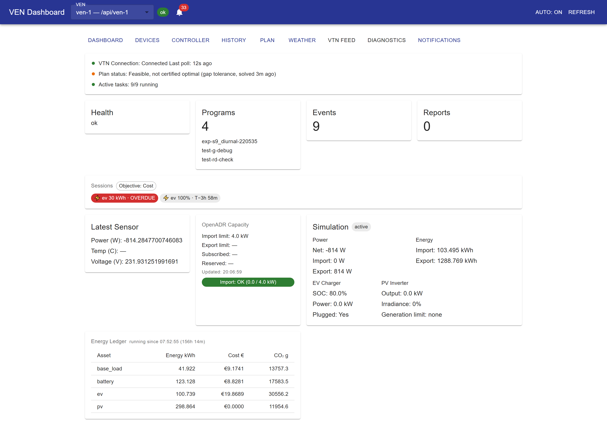
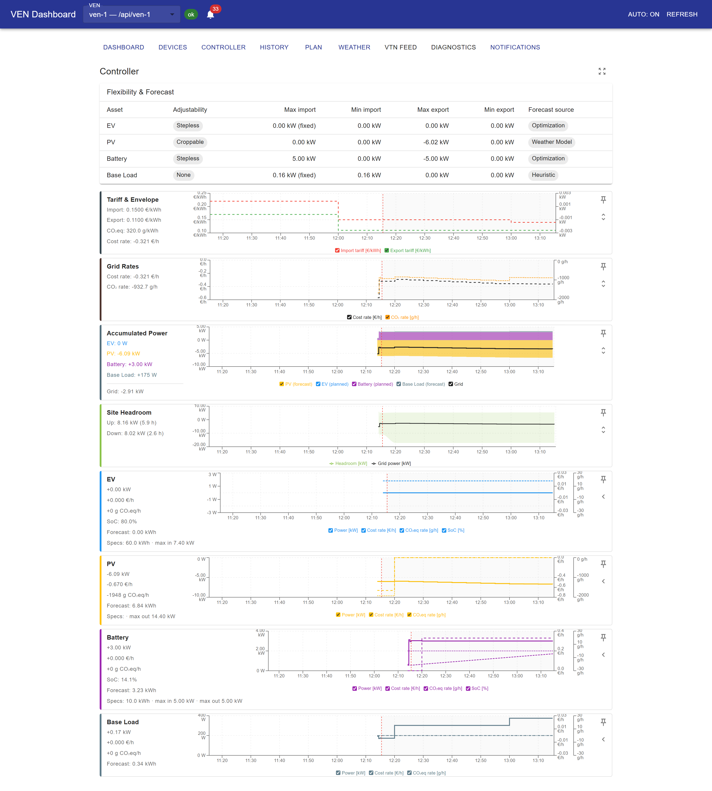
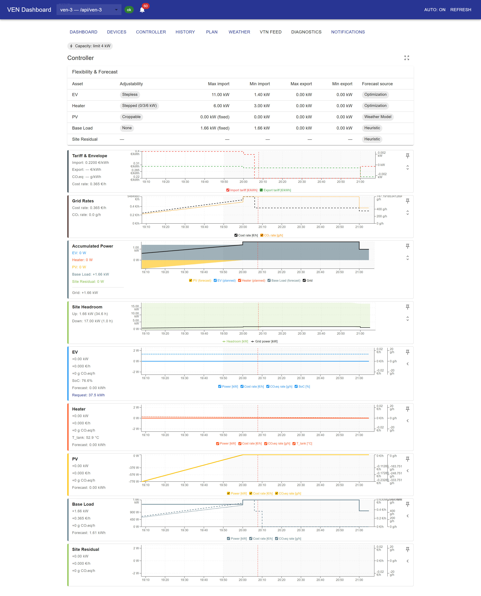
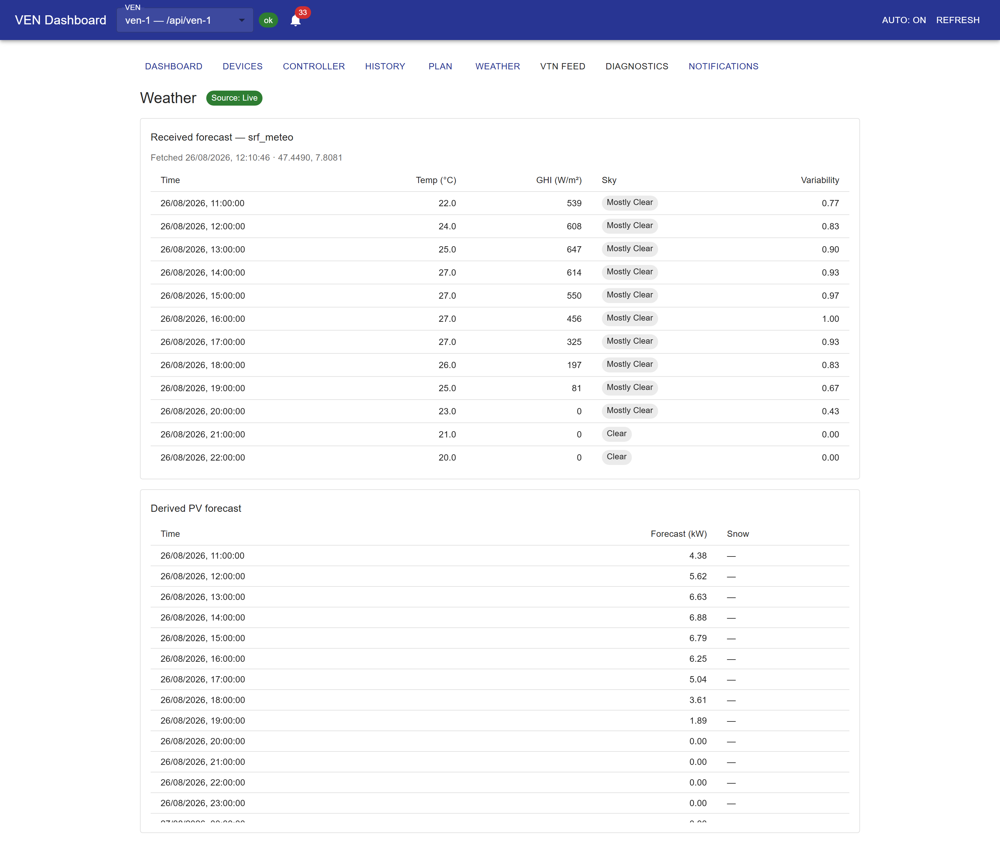
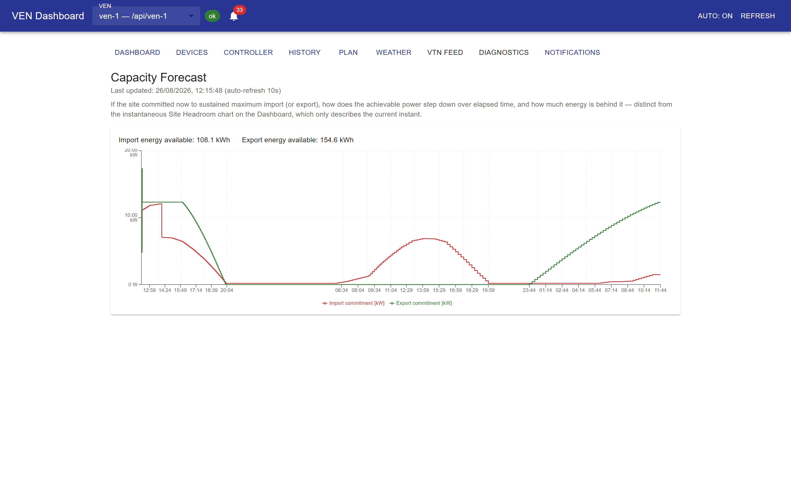
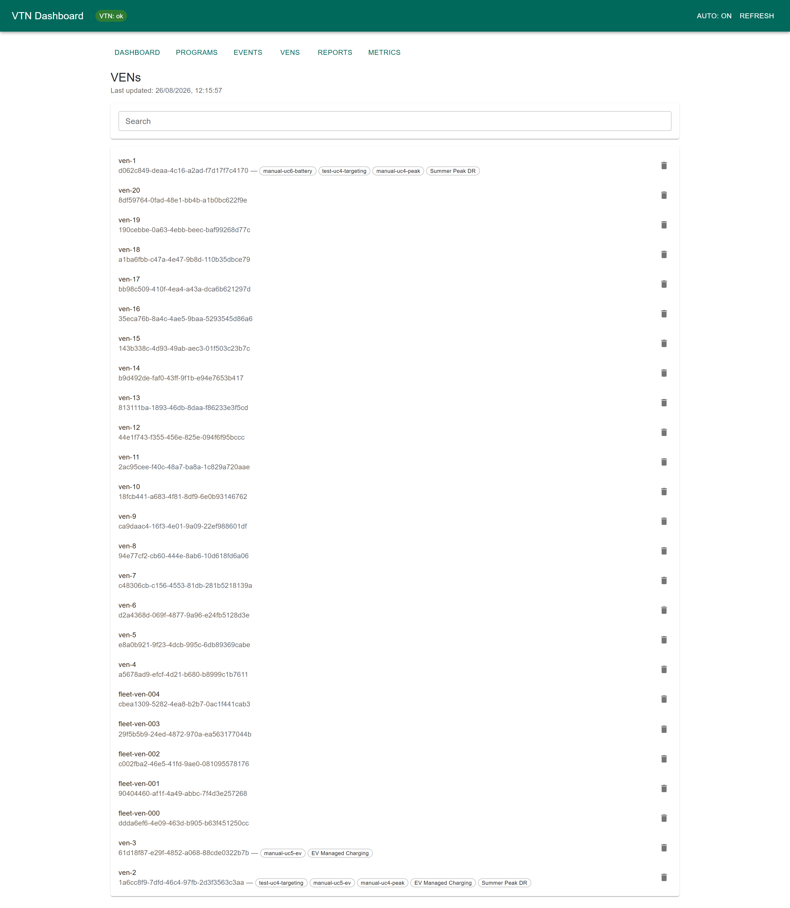
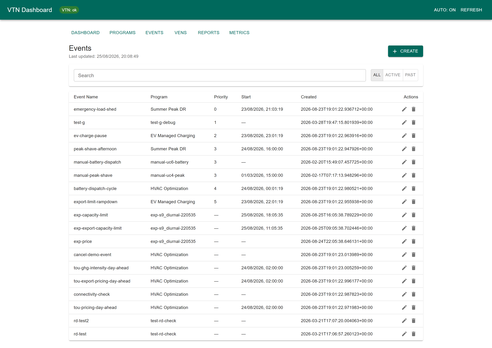

# OpenADR 3 Raspberry Pi Lab

A self-hosted **OpenADR 3 laboratory** for demand-response experimentation: a real VTN,
a fleet of up to 20 independent VEN agents — each one a small home-energy-management
system (HEMS) that plans its own day with a MILP optimiser — and a scripted experiment
harness that measures how those agents react to the VTN's control methods.

Node1 (a Raspberry Pi 4) hosts the VTN stack and `ven-1`…`ven-3`; Node2 is a second
Docker host carrying `ven-4`…`ven-20` (`VEN/scale_out/node2/`).

## The context

This project is built around the https://github.com/OpenLEADR/openleadr-rs project, and adds infrastructure to experiment and demonstrate. It is close to 100% written by AI which allowed me to get fast progress in short time. 
Tests guarantee the expected behaviour, side effects have not been checked, so no warranties for that!

## What the lab does

**Each VEN is a HEMS, not just an OpenADR client.** It polls the VTN for programs and
events, simulates its own assets (battery, EV charger, heater tank, PV, base load), and
every planning cycle solves a **MILP** over a rolling slot grid to decide what each asset
should do — trading energy cost, CO₂ intensity, and resident comfort against the
obligations the VTN imposed. It then dispatches the plan, tracks deviation, and submits
OpenADR reports, including `BASELINE` counterfactual reports for measurement &
verification.

- **Comfort is first-class** — residents place *user requests* ("EV to 80 % by 07:00",
  "at most €3 for this charge") in several modes (`ASAP`, `BY_DEADLINE`,
  `OPPORTUNISTIC`, `MAX_COST`, …) and can override the comfort curve the MILP rewards
  against. Fleet VENs are provisioned from **personas** (`eco`, `comfort`, `commuter`)
  so the fleet reacts heterogeneously to the same signal.
- **Real external inputs, not only synthetic ones** — a live weather forecast arrives
  over MQTT and drives a physics-based PV forecast (transposition, sky condition, snow
  cover); `ven-1` additionally ingests a **real PV inverter and house meter** over MQTT
  and uses them as ground truth.
- **The VEN learns from its own history** — a per-VEN SQLite history store feeds learned
  weekday/weekend heuristics back into the planner, and forecast accuracy is tracked
  against what actually happened.
- **Everything is visible** — every backend capability, feed, and derived value has a
  surface in the VEN UI: plan, capacity forecast, weather, measurements, plan history,
  tasks, raw diagnostics.

**On the VTN side**, the operator UI shows programs, events, enrolled VENs, and their
reports; a *lab recorder* archives every report (with submission lag) into PostgreSQL so
an experiment can be scored afterwards from durable data rather than from screen-scraping.

## Architecture

```
Node1 — Raspberry Pi 4 (Docker)            Node2 — second Docker host
+---------------------------------------+  +----------------------------+
|  VTN Stack                            |  |  VEN Fleet                 |
|  +--------+  +--------+  +---------+  |  |  +-------+     +--------+  |
|  | VTN    |  | BFF    |  | VTN UI  |  |  |  | VEN-4 | ... | VEN-20 |  |
|  | :8200  |  | :8220  |  | :8221   |  |  |  | :8211 |     | :8230  |  |
|  +--------+  +--------+  +---------+  |  |  +-------+     +--------+  |
|  | DB     |  (+ lab recorder tables)  |  |         |                  |
|  | :8201  |        openadr-net        |  +---------|------------------+
|  +--------+                           |            | LAN (OpenADR 3)
|                                       |<-----------+
|  VEN Stack                            |
|  +---------+  +---------+  +---------+|        MQTT broker
|  | VEN-1   |  | VEN-2   |  | VEN-3   ||   weather forecast + real
|  | :8211   |  | :8212   |  | :8213   ||<-- PV / house-meter readings
|  +---------+  +---------+  +---------+|
|  | VEN UI  |                          |
|  | :8214   |                          |
|  +---------+                          |
+---------------------------------------+
```

| Component | Technology | Description |
|---|---|---|
| VTN | [openleadr-rs](https://github.com/OpenLEADR/openleadr-rs) (Rust) | OpenADR 3 Virtual Top Node |
| DB | PostgreSQL 16 | VTN persistence (auto-migrated) + lab recorder archive |
| BFF | Rust (axum) | Backend-for-frontend with dual OAuth credentials |
| VTN UI | React + MUI + nginx | Operator dashboard (programs, events, VENs, reports) |
| VEN | Rust (axum + tokio) | HEMS agent: OpenADR client, asset simulation, MILP planner (HiGHS), reporting |
| VEN UI | React + MUI + nginx | Device dashboard (plan, assets, weather, history, diagnostics) |
| Fleet | `fleet.sh` + `VEN/scale_out/node2/` | Arbitrary-N VEN bring-up with persona-driven diversity |
| Experiments | Python (`experiments/`) | Scenario runner, KPI extraction, comparison reports |

## Setup

### Prerequisites

- Linux host with Docker and Docker Compose v2
- Git with submodule support
- Python 3 + `requests` library (for seeding: `pip3 install requests`)

### 1. Clone the repository

```bash
git clone --recursive https://github.com/TinkerPhu/OpenAdr-Lab.git
cd OpenAdr-Lab
```

If you already cloned without `--recursive`:
```bash
git submodule update --init
```

**One-command setup:** `bash scripts/setup_all.sh` runs steps 2–4 below (VTN
stack, seed, VEN stack) in one go, waiting for each service to become
healthy before continuing. Use `--fresh` to reset the VTN database first, or
`--skip-seed` to skip seeding. Run the steps manually instead if you want to
inspect each stage:

### 2. Deploy the VTN stack

The VTN stack includes PostgreSQL, the openleadr-rs VTN, the BFF proxy, and the VTN operator UI.

> **Note:** First build compiles openleadr-rs from source. Expect ~25 min on a Raspberry Pi 4, ~5 min on a modern x86 machine.

```bash
cd VTN
docker compose up -d --build
cd ..
```

The VTN auto-migrates its database on first boot (15 tables via SQLx). Fixture credentials (`any-business`, `ven-manager`, `ven-1`…`ven-3`) are seeded automatically.

Verify:
```bash
curl http://localhost:8200/health
```

### 3. Seed demo programs and events

```bash
python3 scripts/seed_vtn.py --vtn-url http://localhost:8200
```

Creates 3 demand response programs and 6 events (see [Seeded Data](#seeded-data)). Safe to re-run — skips programs that already exist.

### 4. Deploy the VEN stack

The VEN stack runs 3 VEN instances and the VEN device UI.

> **Note:** First build compiles the VEN Rust application, including the HiGHS MILP solver. Expect ~11 min on a Raspberry Pi 4, ~2 min on x86.

```bash
cd VEN
docker compose up -d --build
cd ..
```

Verify:
```bash
curl http://localhost:8211/health
curl http://localhost:8212/health
curl http://localhost:8213/health
```

### 5. Open the UIs

| UI | URL | Description |
|---|---|---|
| VTN Operator UI | `http://localhost:8221` | Programs, events, VENs, reports |
| VEN Device UI | `http://localhost:8214` | Plan, assets, weather, history, diagnostics |

The VEN UI's VEN selector lists `ven-1`…`ven-3` plus every additional VEN that is
registered with the VTN and reachable — including VENs running on a second host.

---

**Remote host (e.g. Raspberry Pi accessed via SSH)?** Push the repo to the host first, then run the same commands over SSH:

```bash
# Initial copy
rsync -av --exclude=target --exclude=node_modules OpenAdr-Lab/ pi@raspberrypi:/srv/openadr_lab/

# Deploy
ssh pi@raspberrypi "cd /srv/openadr_lab/VTN && docker compose up -d --build"
ssh pi@raspberrypi "cd /srv/openadr_lab && python3 scripts/seed_vtn.py --vtn-url http://localhost:8200"
ssh pi@raspberrypi "cd /srv/openadr_lab/VEN && docker compose up -d --build"
```

Replace `pi@raspberrypi` and `/srv/openadr_lab` with your host and path. Access the UIs at `http://<host-ip>:8221` and `http://<host-ip>:8214`.

## Screenshots

**VEN Dashboard** — VTN connection, plan status, running tasks, live asset state and the
running energy/cost/CO₂ ledger for one VEN:



The **Controller** tab visualizes the live plan: tariff and CO₂eq signals, per-asset
flexibility and forecast source, accumulated power, site headroom, and per-asset forecast
vs. planned curves. Each VEN has a different asset mix:

| ven-1 — battery + EV + PV | ven-3 — heater + EV + PV |
|---|---|
|  |  |

**Weather & PV forecast** — the MQTT weather feed and the physics-based PV forecast
derived from it:



**Capacity Forecast** — the sustained-commitment power/duration/energy envelope: how far
the site's max import/export commitment can be sustained over time, distinct from the
Dashboard's instantaneous Site Headroom:



**VTN Operator UI** — the enrolled VENs of the fleet, and the events an operator dispatches:

| VENs | Events |
|---|---|
|  |  |

## Scaling out to a fleet

`fleet.sh` brings up an arbitrary number of extra VENs on one host, generating a
seeded-random asset mix per instance and registering each with the VTN:

```bash
bash fleet.sh up 10 --personas eco:0.4,comfort:0.4,commuter:0.2
bash fleet.sh status          # per-VEN health + VTN registration
bash fleet.sh down --purge    # stop, and remove data/profiles
```

For a fleet larger than one Pi can hold, `VEN/scale_out/node2/` runs `ven-4`…`ven-20` on
a second Docker host that reaches the VTN over the LAN (ports `8211`, `8215`…`8230`).
Their profiles live in `VEN/profiles/ven-{4..20}.yaml` and deliberately cover different
asset mixes.

## Experiments

`experiments/` turns the lab into a measurement instrument. A scenario is a YAML list of
VTN-side actions (post a tariff, impose a capacity limit, raise an alert, dispatch); the
runner replays it against the live stack, then snapshots each VEN's history store and the
VTN recorder tables for scoring.

```bash
python3 experiments/run_experiment.py --scenario experiments/scenarios/s2_price_spike.yaml \
    --vens ven-1,ven-2,ven-3 --out experiments/results
python3 experiments/kpi.py    experiments/results/<run-dir>
python3 experiments/report.py experiments/results/<run-dir>
```

Scenarios `s1`…`s10` cover flat tariff, price spike, capacity limit, alert, dispatch,
combined, stress, budget shortfall, a 24 h diurnal run, and over-export. Runs happen in
real time and are paired with a same-VEN no-event baseline window, so KPIs such as
`energy_shifted_kwh` and `event_impact_kwh` have a comparable reference. `--fleet-map`
routes snapshots across both Docker hosts.

## Testing

The project includes integration tests (behave/BDD), resilience tests, and E2E browser tests (Playwright), all running in Docker.

```bash
bash run_all_tests.sh              # run everything
bash run_all_tests.sh --local      # UI unit tests only (vitest)
bash run_all_tests.sh --e2e        # E2E behave tests only
bash run_all_tests.sh --resilience # resilience tests only
bash run_all_tests.sh --rust       # openleadr-rs cargo tests only
```

Configure the docker host at the top of `run_all_tests.sh`:

```bash
DOCKER_HOST=""                        # "" = run docker commands locally (no SSH)
                                      # set to e.g. "Node1" for a remote host
DOCKER_DIR="/srv/docker/openadr_lab"  # repo path on the docker host
```

GitHub Actions runs lint/audit/DCO checks on PRs and the file-size audit on
pushes; the E2E workflow is manual-dispatch only. Run the full suite yourself
before merging.

## Running on a different Linux Docker host

The project was developed on a Raspberry Pi 4 (ARM64). All images are multi-arch and the application code is architecture-agnostic, so it runs on any Linux Docker host. Three things need to be adjusted:

**1. `run_all_tests.sh`** — set your host and repo path:
```bash
DOCKER_HOST=""                        # "" = local; or SSH hostname e.g. "my-server"
DOCKER_DIR="/your/repo/path"
```

**2. `tests/docker-compose.openleadr-test.yml`** — remove the resource caps (they prevent OOM crashes on a 4 GB Raspberry Pi; unnecessary on bigger machines):
```yaml
# delete or raise this block:
deploy:
  resources:
    limits:
      cpus: '1.5'
      memory: 1500M
```

**3. `tests/Dockerfile.openleadr-test`** — remove or raise the Cargo job limit (set to 4 to avoid OOM during linking on a Pi):
```dockerfile
# delete or set higher, e.g. ENV CARGO_BUILD_JOBS=8
ENV CARGO_BUILD_JOBS=4
```

## Project Structure

```
OpenAdr-Lab/
  VTN/
    docker-compose.yml    # VTN + DB + BFF + UI
    bff/                  # Rust axum BFF (dual-credential proxy)
    ui/                   # React VTN operator UI
  VEN/
    src/                  # Rust VEN application (hexagonal rings)
    profiles/             # Per-VEN asset mix and tuning (ven-1..ven-20)
    scale_out/node2/      # ven-4..ven-20 on a second Docker host
    docker-compose.yml    # 3 VEN instances + VEN UI
    ui/                   # React VEN device UI
  openleadr-rs/           # Git submodule (TinkerPhu fork)
  fleet.sh                # Arbitrary-N fleet lifecycle (up/status/down)
  experiments/
    scenarios/            # S-1..S-10 control-method scenarios (YAML)
    run_experiment.py     # Scenario runner + data snapshotter
    kpi.py, report.py     # KPI extraction and comparison reports
  scripts/
    seed_vtn.py           # Seed programs, events, and VEN enrollment
    gen_fleet_profiles.py # Persona-driven profile generation
    personas.py           # eco / comfort / commuter presets
  tests/
    features/             # Behave BDD scenarios
    docker-compose.test.yml
  docs/
    architecture/         # System design, concepts, diagrams
    use-cases/            # Use case definitions and manuals
    guidelines/           # Coding and testing conventions
    reference/            # KEY_LEARNINGS, GLOSSARY, FAQ, TECHNICAL_DEBTS
    plans/                # Roadmap and implementation plans
    history/              # Project journal
    images/               # README screenshots
    openadr_3_1_specs/    # OpenADR 3.1.0 specification (markdown)
    BACKLOG.md            # Future work wishlist
  wiki/                   # Cross-linked knowledge base (concepts, components, decisions)
```

## Documentation

| Document | Description |
|---|---|
| [Application Documentation](DOCUMENTATION.md) | Purpose, features, architecture, and operational guidance |
| [VEN Architecture](docs/architecture/VEN_ARCHITECTURE.md) | VEN system design, rings, ports, control path |
| [VTN Architecture](docs/architecture/VTN_ARCHITECTURE.md) | VTN stack design (openleadr-rs, BFF, UI) |
| [MILP Planner](docs/architecture/ven_milp_planner.md) | Slot grid, adoption gate, warm starts, comfort curves, shadow prices |
| [Asset Simulation](docs/architecture/asset_simulation.md) | Physics simulation of battery, EV, heater, PV, base load |
| [Forecasting Model](docs/architecture/forecasting_model.md) | Where each forecast comes from: exogenous drivers vs. endogenous response |
| [Weather Forecast](docs/architecture/weather_forecast.md) | MQTT weather feed and the physics-based PV forecast |
| [Real-Measurement Feeds](docs/architecture/real_measurement_mqtt.md) | Connecting a real inverter or meter over MQTT |
| [System Use Case Manual](docs/use-cases/SYSTEM-USE-CASE-MANUAL.md) | Step-by-step guide for demand response use cases |
| [HEMS Use Case Manual](docs/use-cases/HEMS-USE-CASE-OBSERVATION-MANUAL.md) | Observing HEMS planning behaviour |
| [Comfort & Personas Manual](docs/use-cases/COMFORT-PERSONAS-USE-CASE-MANUAL.md) | Request modes, comfort curves, notifications, personas |
| [Use Cases](docs/use-cases/SYSTEM-USE-CASES.md) | Use case definitions and test coverage |
| [Testing Guide](docs/guidelines/TESTING.md) | Test strategy, running tests, and CI setup |
| [React Guidelines](docs/guidelines/REACT_GUIDELINES.md) | UI development conventions |
| [Key Learnings](docs/reference/KEY_LEARNINGS.md) | Hard-won lessons from implementation |
| [FAQ](docs/reference/FAQ.md) | Common questions and troubleshooting |
| [Glossary](docs/reference/GLOSSARY.md) | OpenADR terminology reference |
| [Project Journal](docs/history/project_journal.md) | Implementation history and phase summaries |
| [Backlog](docs/BACKLOG.md) | Future work wishlist |
| [Plans & Roadmap](docs/plans/) | Strategic roadmap and in-flight implementation plans |
| [Wiki](wiki/index.md) | Cross-linked knowledge base with traceability to code |

## Seeded Data

| Program | Enrolled VENs | Description |
|---|---|---|
| Summer Peak DR | ven-1, ven-2 | Peak demand reduction |
| EV Managed Charging | ven-2, ven-3 | Coordinated EV charging |
| HVAC Optimization | all (open) | Building HVAC load management |

## License

[MIT](LICENSE)
