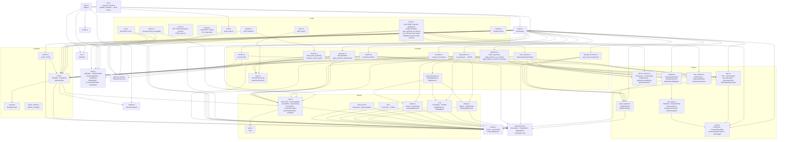

# VEN Backend — Component & Dependency Diagram

```mermaid
graph TD
    %% ── Entry Points ──────────────────────────────────────────────
    MAIN["main.rs\nAppCtx"]
    LOOPS["loops.rs\norchestrator"]
    CONFIG["config.rs"]
    STATE["state.rs\nAppState · SimInjectState\nAssetLedgerEntry · EvSettings\nPollingState · ControllerSimState · HemsState"]
    VTN["vtn.rs\nVtnClient"]
    MODELS["models.rs\nSensorSnapshot"]
    IDS["ids.rs\nasset ID constants\n(ASSET_BOILER — dead code?)"]
    PROFILE["profile.rs\nProfile · AssetProfile\nPlannerObjective"]
    PLAN_EVT["planner_events.rs\nPlannerEvent tx/rx"]

    %% ── Routes ────────────────────────────────────────────────────
    subgraph ROUTES["routes/"]
        R_MOD["mod.rs\nbuild_router()"]
        R_SIM["sim.rs\nGET/POST /sim/*"]
        R_EVT["events.rs\nGET /events /programs /sensors\nPOST /sensors"]
        R_RPT["reports.rs\nGET/POST /reports\nPUT /reports/:id"]
        R_HEMS["hems.rs\n/plan /tariffs /capacity /obligations\n/ledger /flexibility\n/user-requests /ev-session\n/ev-settings /heater-target\n/shiftable-loads /baseline-override"]
        R_ASSET["assets.rs\n/forecast /history /capability"]
        R_TL["timeline.rs\nGET /timeline/*"]
        R_TRACE["trace.rs\nGET /trace/*"]
        R_SYS["system.rs\n/health /metrics"]
    end

    %% ── Controller ────────────────────────────────────────────────
    subgraph CTRL["controller/"]
        C_OA["openadr_interface.rs\nparse_rate_snapshots()"]
        C_DISP["dispatcher.rs\nbuild_setpoints()\napply_surplus_ev_overlay()\napply_battery_correction_overlay()"]
        C_MILP["milp_planner.rs\nrun_planner()  ← HiGHS"]
        C_MILPI["milp_interactions.rs\nGlobalMilpInputs\nMilpVarPool"]
        C_ABS["absorber.rs\nAbsorberState\napply_deviation_absorption()"]
        C_ENV["envelope.rs\ncompute_envelope()"]
        C_MON["monitor.rs\nrecord_tick()"]
        C_RPT2["reporter.rs\ntelemetry builders"]
        C_TL2["timeline.rs\nbuild_asset_timeline()\ncompute_uniform_grid()"]
        C_TRACE["trace.rs\nControllerEvent log\nAssetTimelinePoint"]
        C_UR["user_request.rs\nCreateUserRequestBody"]
    end

    %% ── Entities ──────────────────────────────────────────────────
    subgraph ENT["entities/"]
        E_ASSET["asset.rs\nAssetType · PowerAdjustability\nDeviceResponsiveness · PlanTrigger"]
        E_PLAN["plan.rs\nPlan · PlanTimeSlot\nAssetAllocation · PlanningHorizon\nSiteFlexibilityEnvelope"]
        E_DS["device_session.rs\nEvSession · HeaterTarget\nShiftableLoad · ShiftableLoadRuntime\nBaselineOverride"]
        E_CAP["capacity.rs\nOadrCapacityState\nOadrEventCache\nOadrReportObligation"]
        E_TARIFF["tariff_snapshot.rs\nTariffSnapshot\nTariffTimeSeries"]
        E_UR2["user_request.rs\nUserRequest · RequestDeadline\nUserRequestStatus"]
        E_SITE["site_meter.rs\nSiteMeter · DispatchState\nDeviceSession\nDispatchCommand · PowerSnapshot"]
    end

    %% ── Simulator ─────────────────────────────────────────────────
    subgraph SIM["simulator/"]
        S_MOD["mod.rs\nSimState · AssetEntry\nSimSnapshot"]
        S_ENERGY["energy.rs\nEnergyCounter"]
        S_POWER["power_model.rs\nrandom_voltage()"]
        S_PERSIST["persist.rs\nsave() / load()"]
    end

    %% ── Assets ────────────────────────────────────────────────────
    subgraph ASSETS["assets/"]
        A_MOD["mod.rs\nAsset trait · AssetCapability\nAssetState · AssetConfig\nControlKind · ControlDescriptor\nAssetHistoryBuffer · GridState"]
        A_BAT["battery.rs\nBattery · BatteryState\nBatteryMilpContext"]
        A_EV["ev.rs\nEvCharger · EvState\nEvMilpContext · EvMilpMode"]
        A_HTR["heater.rs\nHeater · HeaterState\nHeaterMilpContext"]
        A_PV["pv.rs\nPvInverter · PvState"]
        A_BL["base_load.rs\nBaseLoad · BaseLoadState"]
        A_GRID["grid.rs\nGrid"]
    end

    %% ── Common ────────────────────────────────────────────────────
    COMMON["common/mod.rs\nTimeSeries · Interpolation · Aggregation\ninterpolate_at()"]

    %% ══════════════════════════════════════════════════════════════
    %% EDGES — top-level wiring
    %% ══════════════════════════════════════════════════════════════
    MAIN --> LOOPS
    MAIN --> STATE
    MAIN --> CONFIG
    MAIN --> VTN
    MAIN --> PROFILE
    MAIN --> PLAN_EVT
    MAIN --> R_MOD

    LOOPS --> VTN
    LOOPS --> STATE
    LOOPS --> MODELS
    LOOPS --> PROFILE
    LOOPS --> PLAN_EVT
    LOOPS --> C_OA
    LOOPS --> C_DISP
    LOOPS --> C_ABS
    LOOPS --> C_ENV
    LOOPS --> C_MON
    LOOPS --> C_MILP
    LOOPS --> C_RPT2
    LOOPS --> S_MOD
    LOOPS --> S_PERSIST
    LOOPS --> E_ASSET
    LOOPS --> E_CAP
    LOOPS --> E_PLAN
    LOOPS --> E_TARIFF
    LOOPS --> A_MOD

    %% Routes → AppCtx (implicit via State extractor)
    R_MOD --> STATE
    R_SIM --> STATE
    R_SIM --> S_MOD
    R_ASSET --> S_MOD
    R_ASSET --> A_MOD
    R_TRACE --> C_TRACE
    R_HEMS --> C_UR
    R_HEMS --> E_UR2
    R_HEMS --> E_DS
    R_HEMS --> E_ASSET
    R_HEMS --> PROFILE
    R_HEMS --> PLAN_EVT
    R_TL --> S_MOD
    R_TL --> C_TL2

    %% Controller internal deps
    C_OA --> E_CAP
    C_OA --> E_TARIFF
    C_OA --> COMMON
    C_DISP --> A_MOD
    C_DISP --> E_PLAN
    C_DISP --> E_CAP
    C_DISP --> S_MOD
    C_MILP --> A_BAT
    C_MILP --> A_EV
    C_MILP --> A_HTR
    C_MILP --> C_MILPI
    C_MILP --> E_PLAN
    C_MILP --> E_DS
    C_MILP --> E_TARIFF
    C_MILP --> S_MOD
    C_MILP --> PROFILE
    C_MILPI --> A_BAT
    C_MILPI --> A_EV
    C_MILPI --> A_HTR
    C_ABS --> A_MOD
    C_ABS --> E_PLAN
    C_ABS --> S_MOD
    C_ABS --> PROFILE
    C_ABS --> PLAN_EVT
    C_ENV --> E_PLAN
    C_ENV --> S_MOD
    C_MON --> E_TARIFF
    C_MON --> S_MOD
    C_MON --> STATE
    C_RPT2 --> A_MOD
    C_RPT2 --> C_TRACE
    C_RPT2 --> E_CAP
    C_RPT2 --> S_MOD
    C_RPT2 --> COMMON
    C_TL2 --> C_TRACE
    C_TL2 --> E_PLAN
    C_TL2 --> S_MOD
    C_UR --> A_MOD
    C_UR --> E_DS
    C_UR --> E_UR2

    %% Entities internal deps
    E_PLAN --> E_ASSET
    E_PLAN --> PROFILE
    E_CAP --> E_SITE
    E_CAP --> E_TARIFF
    E_TARIFF --> COMMON
    E_SITE --> E_ASSET

    %% Simulator deps
    S_MOD --> A_MOD
    S_MOD --> MODELS
    S_MOD --> PROFILE
    S_MOD --> S_ENERGY
    S_PERSIST --> S_MOD
    S_PERSIST --> PROFILE

    %% Assets deps
    A_BAT --> COMMON
    A_BAT --> PROFILE
    A_EV --> COMMON
    A_EV --> PROFILE
    A_HTR --> COMMON
    A_HTR --> PROFILE
    A_PV --> COMMON
    A_PV --> PROFILE
    A_BL --> COMMON
    A_BL --> PROFILE
    A_MOD --> COMMON
    A_MOD --> A_GRID
```
